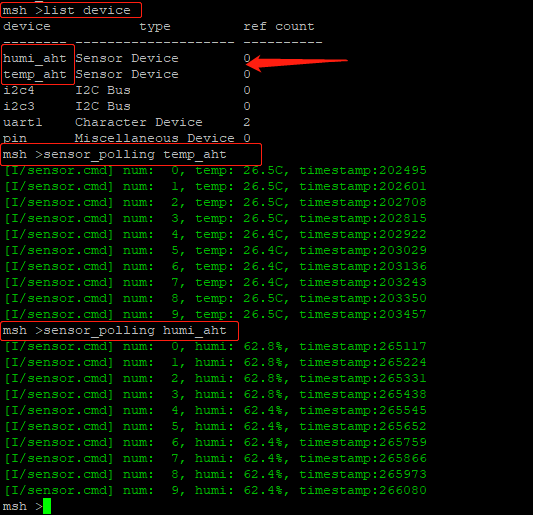

# 第二周：实现温湿度传感器、PM2.5 传感器模块

## 回顾第一周：

第一周已经实现：

【报警模块】led 亮、灭、闪烁。

【按键模块】中断触发按键，在中断回调中执行相应的操作（实现了 led 亮、灭）。

【温湿度传感器驱动】

温湿度传感器模块在没有对接传感器框架之前，我们使用的是 xxx_read_temp()（如 aht0_read_temp()）、xxx_read_humi()（如 aht10_read_humi()）来读取数据。

## 第二周目标与实现：

### 目标：

第一周已经完成了下图黄色部分，第二周完成红色部分。


1、【温湿度传感器驱动对接传感器框架】---- 完善 temp_humi.c

【完成温湿度模块】----application 下创建 temp_humi_th.c，创建温湿度线程

2、【PM2.5 传感器驱动、对接传感器框架】---- 完成 pm25.c

【完成 pm2.5 模块】----application 下创建 pm25_th.c，创建 pm2.5 的线程

3、选做：有甲醛传感器的伙伴也可以将甲醛传感器做起来（参考 pm2.5 模块）

#### 任务 1：

【对接框架 + 应用】将温湿度传感器驱动对接到传感器框架上，并在应用层创建线程。

> 将温湿度传感器驱动对接到传感器驱动框架上去，创建的线程能使用 rt_device_find() 查找传感器设备、rt_device_open() 打开传感器设备，rt_device_read() 来读取温湿度传感器数据。

#### 任务 2：

【驱动 + 对接框架 + 应用】完成 PM2.5 传感器驱动，并对接传感器框架，创建线程

> 由于已经完成了一个温室读传感器驱动及框架的对接，所以应该可以孰能生巧，使用类似的方法，能很快的将 pm2.5 传感器的驱动也写好并且对接到传感器框架上。创建的线程能使用 rt_device_find() 查找传感器设备、rt_device_open() 打开传感器设备，rt_device_read() 来读取传感器数据。

#### 任务 3（选做）：

【驱动 + 对接框架】完成甲醛传感器驱动，并对接传感器框架，创建线程

> 参考任务 2

### 实现任务 1：温湿度传感器对接框架、创建线程步骤：

#### 1.1 准备工作步骤：

**目的：将 temp_humi.c 这个驱动文件放在驱动文件夹下 +  创建线程**

> temp_humi.c 第一周放在了 application 文件夹下，但是其实属于驱动，所以还是将它放入驱动中比较合适。

①将 temp_humi 文件夹中的 temp_humi.c 复制到【bsp\stm32\libraries\HAL_Drivers】目录下

②删除 bsp 下的 temp_humi 文件夹

③修改【bsp\stm32\libraries\HAL_Drivers】目录下的 SConscript 文件，加入温湿度驱动


④在 application 文件夹下新建 temp_humi_th.c

⑤在【bsp\stm32\stm32xxx-xx-xxx\board】下新建一个 ports 文件夹（如果有就不用新建了），该文件夹下新建 sensor_port.c，在该文件中对传感器设备进行自动初始化，解耦硬件接口（如 IIC 从设备的地址）。举例如下：


并在 SConscript 中增加这两句，将 sensor_port.c 文件加入到工程。

```c
src += Glob('ports/sensor_port.c')
path += [cwd + '/ports']
```

#### 1.2 实现步骤

对接框架其实就是完善 humi_temp.c。

1、首先在 bsp 下，需要在 env 中打开 sensor 框架


2、其次查看该传感器使用了什么外设接口？比如 aht10 传感器是 IIC 接口，使用了 IIC4，则需要在 env 中打开 IIC4，其他外设也类似。


3、退出并保存配置，使用 scons --target=mdk5 重新生成工程

4、打开工程，在第一周的基础上继续完善 temp_hunmi.c 驱动，实现对接传感器框架，对接传感器驱动框架请参考文档中心指导文档：《[对接传感器框架](https://www.rt-thread.org/document/site/development-guide/sensor/sensor_driver_development/)》。

5、对接到 sensor 框架之后，还需要 sensor_port.c 中对设备进行自动初始化，解耦硬件接口（如 IIC 从设备的地址）。一个示例写法如下：


6、完成之后，烧写代码，通过 list_device 命令查看对应设备是否注册成功。（会发现有传感器设备了：温度设备与湿度设备）


并且可以通过 sensor 的命令 `sensor_polling <sensor_name>` 测试读取传感器数据：



7、打开 application 文件夹下的 temp_humi_th.c，在该文件中创建温湿度传感器线程。创建在函数 temp_humi_init() 中创建线程，线程入口函数为 temp_humi_entry()。使用 rt_device_find/rt_device_open/rt_device_read 对设备进行操作读取数据。

参考：[线程创建](https://www.rt-thread.org/document/site/programming-manual/thread/thread/#_16)


8、在 main.c 中调用 temp_humi_init()


9、烧写代码验证


### 实现任务 2：完成 PM2.5 传感器驱动，并对接传感器框架，创建线程

#### 2.1 准备工作：

①在【bsp\stm32\libraries\HAL_Drivers】目录下新建 pm25.c。

②修改【bsp\stm32\libraries\HAL_Drivers】目录下的 SConscript 文件，加入 pm25 驱动。


③在 application 文件夹下新建 pm25_th.c。

#### 2.2 步骤

(1) 在 pm25.c 中实现驱动。

(2) 完善 pm25.c，实现对接到传感器框架。

(3) 在 sensor_port.c 中，增加对 pm2.5 设备的自动初始化。

(4) 烧写代码，串口助手中通过 list_device 命令验证查看对应设备是否注册成功。

(5) 在 application 文件夹下新建 pm25_th.c，创建 pm25 线程。在函数 pm25_init() 中创建线程，线程入口函数为 pm25_entry()，线程中会调用 rt_device_find/rt_device_open/rt_device_read 对设备进行操作读取数据。

(6) 在 main.c 中调用 pm25_init()。

(7) 烧写代码验证。

#### 2.3 伪代码


### 实现任务 3：完成甲醛传感器驱动，并对接传感器框架，创建线程 

#### 3.1 准备工作：

步骤参考任务 2 即可

#### 3.2 步骤

(1) 在 forma.c 中实现甲醛传感器驱动。

(2) 完善 forma.c，实现对接到传感器框架。

(3) 在 sensor_port.c 中，增加对 forma 设备的自动初始化。

(4) 烧写代码，串口助手中通过 list_device 命令验证查看对应设备是否注册成功。

(5) 在 application 文件夹下新建 forma_th.c，创建 forma 线程。在函数 forma_init() 中创建线程，线程入口函数为 forma_entry()，线程中会调用 rt_device_find/rt_device_open/rt_device_read 对设备进行操作读取数据。

(6) 在 main.c 中调用 forma_init()。

(7) 烧写代码验证

#### 3.3 伪代码


### 参考文档汇总

[对接传感器框架](https://www.rt-thread.org/document/site/development-guide/sensor/sensor_driver_development/)

[线程创建](https://www.rt-thread.org/document/site/programming-manual/thread/thread/#_16)