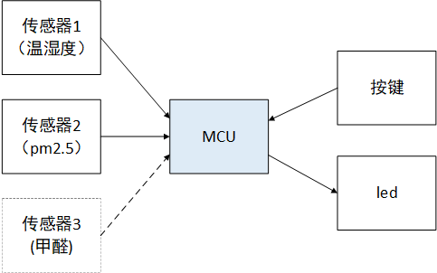
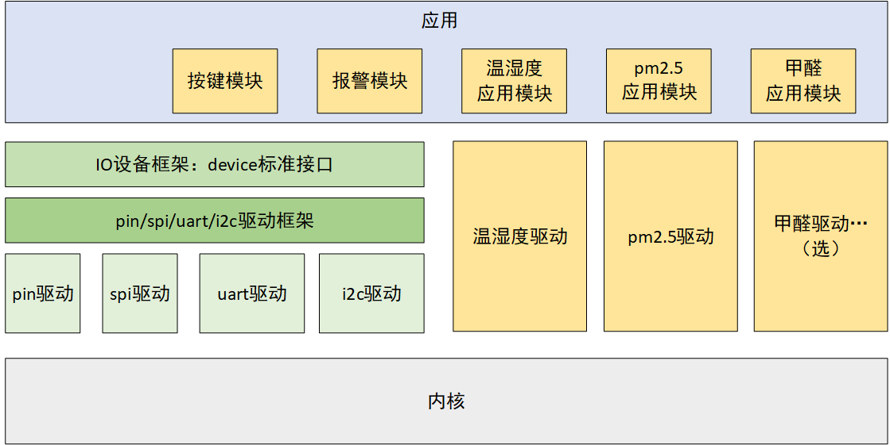

# 第一周：BSP 跑起来、整体框架设计

##  准备工作

### 1、环境准备

-  [获取源码](https://www.rt-thread.org/page/download.html)：下载 4.0.1 发布版本源码，可以在 github、百度网盘等下载。
-  [下载 Env](https://www.rt-thread.org/page/download.html)
-  [安装 keil 5.25 及以上](https://www.rt-thread.org/document/site/tutorial/quick-start/keil/keil/)

### 2、思考：框架设计

思考：哪些线程需要优先级较高？或者说哪些需要通过中断执行？

任务安排：

1：温湿度传感器

2：PM2.5 传感器

3：甲醛传感器

4：报警 LED 灯

5：按键

前三个传感器线程，均是一直轮询检测即可，而且 3 者之间没有先后顺序，可以人为设置优先级，或相同或不同都行。

第四个是报警灯，当传感器数据严重超出范围时，可以使用 LED 进行闪烁报警。每一个传感器对应有一个 led 警报灯，比如温湿度线程对应 led1，PM2.5 线程对应 led2，甲醛线程对应 led3，这样在每类传感器数据有问题时，都能分别警报。

第五个是按键控制，每个传感器对应一个按键，按键按下该传感器开始读取数据 (每秒读一次)；按键再次按下，传感器不工作。按键可以选择使用中断的方式。

## 画框图

### 系统硬件框架图





### 软件框架图





# 第一周目标与实现

## 目标：

任务 1、BSP 跑起来

任务 2、实现按键模块

任务 3、实现报警模块

任务 4、实现温湿度传感器驱动

任务 5、在论坛提交作业（分享学习心得、提问题均可）

## 实现任务 1：BSP 跑起来

①若源码中有与开发板相应的 BSP，那么直接编译下载即可使用。

②若源码中没有相应的 BSP，那么根据 stm32 BSP 制作教程制作一个适合自己开发板的 BSP，[制作教程在这里](https://github.com/RT-Thread/rt-thread/blob/master/bsp/stm32/docs/STM32%E7%B3%BB%E5%88%97BSP%E5%88%B6%E4%BD%9C%E6%95%99%E7%A8%8B.md)。

## 实现任务 2：完成报警模块

在 bsp 下我们需要：

在 application 文件夹中创建报警模块文件：led_alert.c、相应的. h 文件

-  led_alert.c 实现
  -  led_init() 接口可以初始化 led
  -  led_on() 接口可以点亮 led
  -  led_off() 接口可以熄灭 led
  -  led_blink() 接口可以使 led 闪烁，200ms 闪烁周期

在 main 中调用 led_init()，以及以上功能函数做测试，查看 led 情况，完成报警模块功能。

参考文档：[《PIN 设备》](https://www.rt-thread.org/document/site/programming-manual/device/pin/pin/)

## 实现任务 3：完成按键模块

在 bsp 下我们需要：

在 application 文件夹中创建按键模块的文件：key.c、相应的. h 文件

-  key.c 实现：
  -  调用 key_init() 可以初始化 key，中断方式初始化
  -  中断回调为 key_cb()，中断回调中调用 led 的接口：根据检测按键的电平执行 led 的动作，按下按键点亮 led，释放按键熄灭 led

在 main 中调用 key_init() 做测试，按下按键查看 led 情况，完成按键模块功能。

参考文档：[《PIN 设备》](https://www.rt-thread.org/document/site/programming-manual/device/pin/pin/)

## 实现任务 4：完成温湿度传感器的驱动

<u>注意：如果你的传感器在 RT-Thread 软件包中已经存在，那么可以省略该步骤 不用写驱动，直接使用软件包即可.</u>

在 bsp 下我们需要：

① 在【bsp\stm32\libraries\HAL_Drivers】目录下，创建新的驱动文件 `temp_humi.c`，以及相应的 `.h` 文件。

② 修改【bsp\stm32\libraries\HAL_Drivers】目录下的 SConscript 文件，加入温湿度驱动。


- temp_humi.c 驱动实现：
  -  实现 xx_hw_init()，xx 为传感器的前几个字母，如 aht10_hw_init()
  -  实现 xx_read_temp()，xx 为传感器的前几个字母，如 aht10_read_temp()
  -  实现 xx_read_humi()，xx 为传感器的前几个字母，如 aht10_read_humi()

> 注意，在写驱动的时候，如果使用了一些外设，比如 IIC、SPI，则需要使用 Env 打开这些外设，然后就可以在驱动中使用这些外设的一些 API。

测试读数据：在 main() 函数中调用 xx_hw_init() 对温室读传感器进行初始化，使用 xx_read_temp() 与 xx_read_humi() 读取温湿度数据，将数据打印出来，查看数据是否正确。正确获取数据后，删除测试的代码片段，下周会使用创建温室读线程读取温湿度数据。

## 参考文档汇总

[keil 安装](https://www.rt-thread.org/document/site/tutorial/quick-start/keil/keil/)

[STM32 BSP 制作教程](https://github.com/RT-Thread/rt-thread/blob/master/bsp/stm32/docs/STM32%E7%B3%BB%E5%88%97BSP%E5%88%B6%E4%BD%9C%E6%95%99%E7%A8%8B.md)

[PIN 的使用](https://www.rt-thread.org/document/site/programming-manual/device/pin/pin/)

[IIC 的使用](https://www.rt-thread.org/document/site/programming-manual/device/i2c/i2c/)

[SPI 的使用](https://www.rt-thread.org/document/site/programming-manual/device/spi/spi/)

[UART 的使用](https://www.rt-thread.org/document/site/programming-manual/device/uart/uart/)

[参考一个 aht10 的简单驱动](https://www.rt-thread.org/document/site/programming-manual/device/i2c/i2c/#i2c_4)

[参考一个 DHT11 的软件包驱动](https://github.com/murphyzhao/dht11_rtt)

## 附录

#### 简说 PIN 设备：

用过裸机的小伙伴都知道，MCU 引脚可以作为普通 GPIO ,也可以使用其复用功能，如 IIC、UART 等。在 RT-Thread 中，把 GPIO 的使用抽象成 PIN 设备，并注册在了系统之中。

#### 一般使用：

PIN 设备使用起来比裸机 GPIO 简单的多，初始化只需要调用一个函数就可以实现：

```c
void rt_pin_mode(rt_base_t pin, rt_base_t mode);
```

对PIN的操作（读取电平/设置输出电平）也很简单，只需要调用相应的函数：

```c
int rt_pin_read(rt_base_t pin);
void rt_pin_write(rt_base_t pin, rt_base_t value);
```

##### 使用示例：

```c
#define BEEP_PIN_NUM        GET_PIN(B,0)  /* 引脚定义 PB0 */

int main(void)
{    
    led_init();
}

void led_init(void)   //初始化led
{    
  /* led 引脚为输出模式 */
  rt_pin_mode(BEEP_PIN_NUM, PIN_MODE_OUTPUT);
}
```

#### 中断使用：

详见[《PIN 设备》](https://www.rt-thread.org/document/site/programming-manual/device/pin/pin/)


