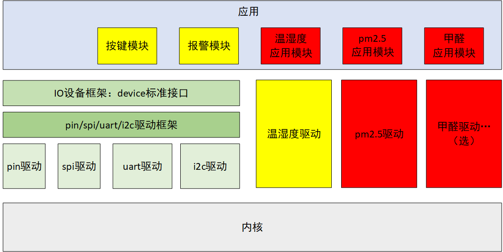
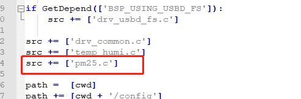

# 第二周：实现温湿度传感器应用、PM2.5 传感器驱动与应用

## 回顾第一周：

第一周已经实现：

【报警模块】led 亮、灭、闪烁。

【按键模块】中断触发按键，在中断回调中执行相应的操作（实现了 led 亮、灭）。

【温湿度传感器驱动】可以使用 xxx_read_temp()（如 aht0_read_temp()）、xxx_read_humi()（如 aht10_read_humi()）来读取数据。

## 第二周目标与实现：

### 目标：

第一周已经完成了下图黄色部分，第二周完成红色部分。



1、【完成温湿度应用模块】----application 下创建 temp_humi_th.c，创建温湿度线程。

2、【PM2.5 传感器驱动】---- 完成 pm25.c。

​      【完成 pm2.5 应用模块】----application 下创建 pm25_th.c，创建 pm2.5 的线程。

3、**选做**：有甲醛传感器的伙伴也可以将甲醛传感器做起来（参考 pm2.5 模块）。

​      【甲醛传感器驱动】---- 完成 forma.c。

​      【完成甲醛应用模块】----application 下创建 forma_th.c，创建甲醛的线程。

4、在论坛提交作业（分享学习心得、提问题均可）

### 实现任务 1：温湿度

1.1、【完成温湿度应用模块】

在 application 文件夹下新建 temp_humi_th.c ，打开 temp_humi_th.c，在该文件中创建温湿度传感器线程。

线程创建在函数 temp_humi_init() 中，线程入口函数为 temp_humi_entry()。调用 xx_hw_init() 初始化温湿度传感器，线程入口函数中调用上面的 xx_read_temp() 与 xx_read_humi() 对传感器进行读取数据操作。

```c
/* application 文件夹下 temp_humi_th.c 的伪代码 */
void temp_humi_entry()
{
    ...
}

void temp_humi_init(void) 
{
    xx_hw_init()；     //如 aht10_hw_init()
    rt_thread_create();
    ...
}
```

在线程入口函数中，将获取到的传感器数据打印出来。

在 main() 中调用 temp_humi_init() 。

### 实现任务 2：pm2.5

2.1、【PM2.5 传感器驱动】

① 在【bsp\stm32\libraries\HAL_Drivers】目录下，新建 pm2.5 模块的驱动文件 pm25.c 及相应的 .h 文件，类似第一周的 `temp_humi.c` 及其 .h 文件。

② 修改【bsp\stm32\libraries\HAL_Drivers】目录下的 SConscript 文件，加入 pm2.5 驱动文件 pm25.c。



- pm25.c 驱动实现：
  - 实现 xx_hw_init()，xx 为传感器型号的前几个字母，如 gp2y_hw_init()
  - 实现 xx_read_pm25()，为传感器型号的前几个字母，如 gp2y_read_pm25()

> 注意，在写驱动的时候，如果使用了一些外设，比如 IIC、SPI，则需要使用 Env 打开这些外设，然后就可以在驱动中使用这些外设的一些 API。

2.2、【完成 pm2.5 应用模块】

在 application 下创建 pm25_th.c，创建 pm2.5 的线程。打开 pm25_th.c，在该文件中创建 pm2.5 传感器线程。

线程创建在函数 pm25_init() 中，线程入口函数为 pm25_entry()。调用 xx_hw_init() 初始化 pm2.5 传感器，线程入口函数中调用上面的 xx_read_pm25() 对传感器进行读取数据操作。

```c
/* application 文件夹下 pm25_th.c 的伪代码 */
void pm25_entry()
{
    ...
}

void pm25_init(void) 
{
    xx_hw_init()；     //如 gp2y_hw_init()
    rt_thread_create();
    ...
}
```

在线程入口函数中，将获取到的传感器数据打印出来。

在 main() 中调用 pm25_init() 。

### 实现任务 3（选）：甲醛

3.1、【甲醛传感器驱动】

参照--实现任务 2，驱动文件为：forma.c ，放在【bsp\stm32\libraries\HAL_Drivers】目录下。

修改【bsp\stm32\libraries\HAL_Drivers】目录下的 SConscript 文件，加入甲醛驱动文件 forma.c。

forma.c 驱动实现：

- 实现 xx_hw_init()，xx 为传感器型号的前几个字母，如 sop30_hw_init()
- 实现 xx_read_forma()，为传感器型号的前几个字母，如 sop30_read_forma()

> 注意，在写驱动的时候，如果使用了一些外设，比如 IIC、SPI，则需要使用 Env 打开这些外设，然后就可以在驱动中使用这些外设的一些 API。


3.2、【完成甲醛应用模块】

参照--实现任务 2，应用模块文件为：forma_th.c

在 application 文件夹下新建 forma_th.c，创建 forma 线程。在函数 forma_init() 中创建线程，线程入口函数为 forma_entry()，线程中会调用  对传感器进行操作读取数据。

```c
/* application 文件夹下 forma_th.c 的伪代码 */
void forma_entry()
{
    ...
}

void forma_init(void) 
{
    xx_hw_init()；     //如 sop30_hw_init()
    rt_thread_create();
    ...
}
```

在线程入口函数中，将获取到的传感器数据打印出来。

在 main() 中调用 forma_init() 。

### 参考文档汇总

[线程创建](https://www.rt-thread.org/document/site/programming-manual/thread/thread/#_16)

## 附录

#### 简说线程：

在裸机中，也是会涉及到功能划分。但是在裸机中，一般功能之间的代码是这样实现的

```c
void main(void)
{
    xx_init();
    XXX_init();
    ...
        
    while(1)
    {
    	do_somthing0();
        delay(10);
        do_somthing1();
        do_somthing2();
        ...
    }
}
```

在RT-Thread中会将三个功能函数变成3个独立的互不干扰的线程趋势线相应的功能：

```c
//main.c
void main(void)
{
    xx_init();
    XXX_init();
}

//可在其他.c文件创建线程、启动线程

    thread0 = rt_thread_create(“thread0”, do_somthing0, ,,);
    rt_thread_startup(rt_thread_t thread0);

    thread1 = rt_thread_create(“thread1”, do_somthing1, ,,);
    rt_thread_startup(rt_thread_t thread1);

    thread2 = rt_thread_create(“thread2”, do_somthing2, ,,);
    rt_thread_startup(rt_thread_t thread2);
```

