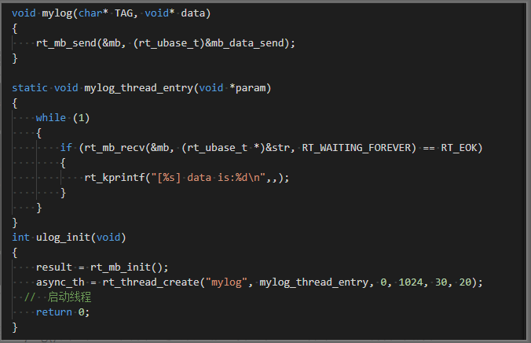
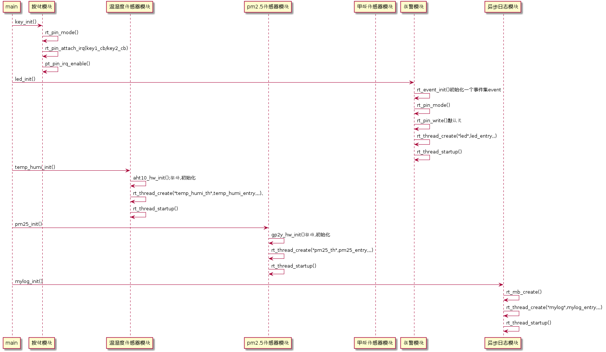
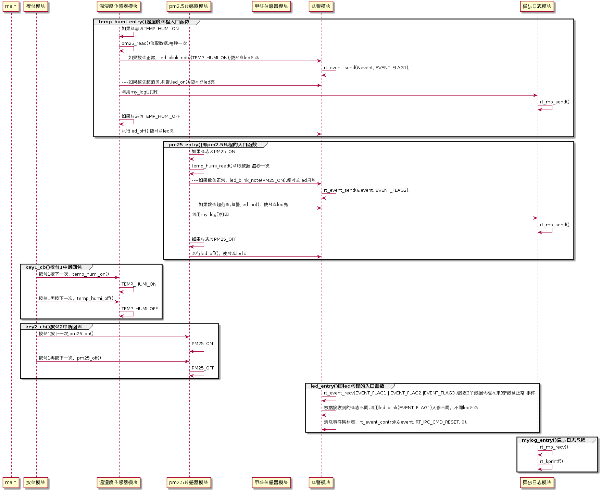

# 第三周：实现异步日志、整个系统跑起来

前两周可以说把所有传感器模块都已经实现了，最后一周加上 IPC 的使用，本次使用邮箱做一个异步日志（代替原本的 rt_kprintf() ），打印传感器数据。

## 回顾第一周：

第一周已经实现：

【报警模块】led 亮、灭、闪烁

【按键模块】中断触发按键，在中断回调中执行相应的操作（实现了 led 亮、灭）

【温湿度传感器驱动】

## 回顾第二周：

第二周已经实现：

【温湿度传感器应用模块】

【PM2.5 传感器驱动、应用模块】

【甲醛传感器驱动、应用模块】【选】

## 第三周目标与实现：

### 目标

#### 任务 1：实现异步日志（熟悉 IPC：邮箱的使用）

- 相信大家打印的时候，使用的都是 rt_kprintf() 函数，但是这个函数是实时打印的，而且在任务切换的过程中很有可能就被抢断了。所以我们现在实现一个异步日志 mylog()，使用 mylog() 进行异步日志的打印。

- 异步日志，通过邮箱传递信息。


最终效果就是：我们会将传感器模块线程中打印数据所使用到的 rt_kprintf() 使用 mylog() 代替，实现异步打印。

此处参考文档：《[邮箱的使用](https://www.rt-thread.org/document/site/programming-manual/ipc2/ipc2/#_2)》

#### 任务 2：系统跑起来（熟悉 IPC：事件集的使用）

现在我们的系统还只是各个模块能运行，模块间没关联。现在要做的就是实现整个体统：

- 每次系统中只有一种传感器模块在获取数据，每秒获取一次。
- key1 按下（奇数次），温湿度传感器开始读数据。
  - 当数据正常时，在每秒的开始，闪烁两下，表示正常读取数据。
  - 当读取的数据超过设定的范围时，led 一直常亮，表示报警。
- key1 再次按下（偶数次），温湿度传感器停止读数据。
  - led 熄灭。
- 其他传感器相同的道理实现：其他的 key2，key3分别控制剩下的传感器。led2、led3 做指示灯。

以上，牵扯到按键、数据读取、led常亮报警、led常灭、led闪烁指示：

```c
按键与读取数据线程的关系：
- 使用标志位。按下按键，读取数据开始或者停止。

读取数据线程与led的关系：
- 读取数据正常，读取一次数据则进行闪烁一次（快速亮灭几下）；在这里加入事件集的使用。
- 读取数据不正常，则执行led常亮。
- 不读取数据，led常灭。
```

那么需要修改各个按键的中断回调函数，在回调函数中修改标志位。

在 led_alert.c 中创建一个 led 的线程。在 led_init() 中创建线程，线程入口函数为 led_entry()。在入口函数中判断标志位，并接收事件，并在接收相应事件后实现相应的led闪烁操作。led_blink()需要增加入参，通过入参，执行相应led的闪烁。led_on()/led_off()也要增加相应的入参，控制不同led亮灭。

此处参考文档：《[事件集的使用](https://www.rt-thread.org/document/site/programming-manual/ipc1/ipc1/#_27)》

#### 任务 3：在论坛提交作业（分享学习心得、提问题均可）

### 实现任务 1：异步日志：

1、能调用 mylog() 进行打印，传入要打印的参数。

 1.1、application 下创建一个 mylog.c 的文件，实现函数 1：mylog_init()

- 该函数 mylog_init() 中创建一个线程，入口函数是 mylog_entry()
- 该函数中创建一个邮箱 mb
- 将函数 mylog_init() 放在 main 中进行初始化

1.2、实现入口函数：mylog_entry()

- 在该函数中 RT_WAITING_FOREVER 方式接收邮件，接收到邮件调用 `rt_kprintf("[%s] data is:%d\n", xx, xxx);` 进行打印，将邮件内容打印出来。

1.3、在 mylog.c 的文件，实现函数 2：mylog()

- mylog() 的参数至少有两个 `mylog(char* tag,  void* data)`，tag 表示数据类型（如 temp），data 表示数据大小。
- 在该函数中发送邮件，邮件内容是线程要打印的参数。

2、mylog.c 伪代码：



3、测试：在 main 中使用 mylog() 测试，里面传入参数，烧写程序，查看串口终端打印的现象。

如下测试举例：（当 mylog() 的两个参数：tag 为”main”,data 为一个自加的值时）。

```
[main]data is:1
[main]data is:2
[main]data is:3
...
```

 4、将传感器线程中打印数据的 rt_kprintf()，使用 mylog() 代替，完成后，查看打印情况。

### 实现任务 2：系统跑起来：

这是一个系统框架实现图供参考，由于图片大小有限，所以分为以下两部分，且没有将甲醛传感器的部分放上去。

> 有甲醛传感器的伙伴，可以参考温湿度与 PM2.5 传感器。

框图前半部分，主要是做初始化：



框图后半部分，主要是各个模块线程的实现以及相关函数的实现：




以上，一个空气质量分析仪完成。

## 参考文档汇总

[邮箱的使用](https://www.rt-thread.org/document/site/programming-manual/ipc2/ipc2/#_2)

[事件集的使用](https://www.rt-thread.org/document/site/programming-manual/ipc1/ipc1/#_27)

