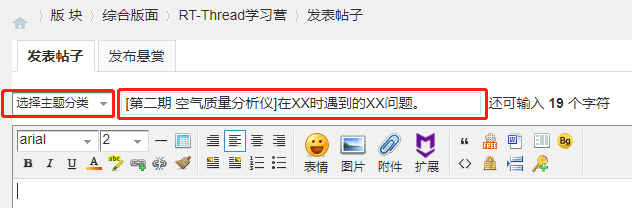

# 第 2 期学习营——空气质量分析仪

#### 目的

以空气质量分析仪原型为项目掌握 RT-Thread 的运用。

> 注意：与第 1 期内容稍有不同之处，不再对接 sensor 框架，增加了 IPC 的使用。

####  面向群体

面向裸机转 RTOS 用户（你应该有很好的嵌入式基础）、刚开始学习 RTOS 的小白、学了 RT-Thread 内核但不知道怎么使用。

#### 实现功能

空气质量检测仪：采集空气质量数据，打印数据，根据需要设置 LED 报警灯，按键切换数据类型。

#### 自备硬件

STM32 控制板（型号不限，必备）+ 温湿度传感器（必备）+PM2.5 传感器（必备）+ 甲醛传感器（选配）+ 报警 LED 灯（板载）+ 按键（板载）+ 其他合适传感器（选配）


## 学习安排：

本次学习营以应用为导向，涉及到内核理论部分需要自行查阅文档。

- 第一周：BSP 跑起来 + 框架设计
- 第二周：实现线程 1/2/3 数据采集，串口打印
- 第三、四周：任务间通信，实现最终 demo

任务安排：

- 线程 1：温湿度传感器
- 线程 2：PM2.5 传感器
- 线程 3：甲醛传感器（选）
- 报警 LED 灯
- 按键

## 涉及内容：

STM32 BSP 制作、线程创建、Env 的使用、外设的使用、写传感器驱动、任务间通信的 IPC 的使用。

## 注意：

- 本次线上学习营以项目为导向，涉及到的理论、原理类知识，均提供参考文档，需要自己对照文档学习和理解。

- 本学习营不提供项目源码。

- 不明白的地方可以提出来，我们会提供技术支持答疑。

### 答疑、分享与交作业

关于提问答疑、交作业，你可以在 [官方论坛的 RT-Thread 学习营版块](https://www.rt-thread.org/qa/forum-42-1.html) 中 **发表新主题** 帖，描述你的疑问，将有人及时为你解答。注意在发新的主题帖时，**选择主题分类** 为 “实战入门学习营” 。

```
提问类标题：[第二期 空气质量分析仪]在XX时遇到的XX问题。发出你的疑问。
交作业标题：[第二期 空气质量分析仪]第X周作业。提交学习营每周的作业~。
分享类标题：[分享][第二期 空气质量分析仪]关于XXX的理解/原理之类的。分享你的学习成果。
```

